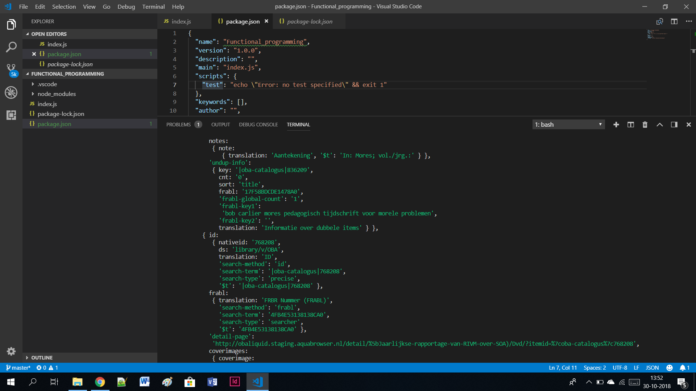
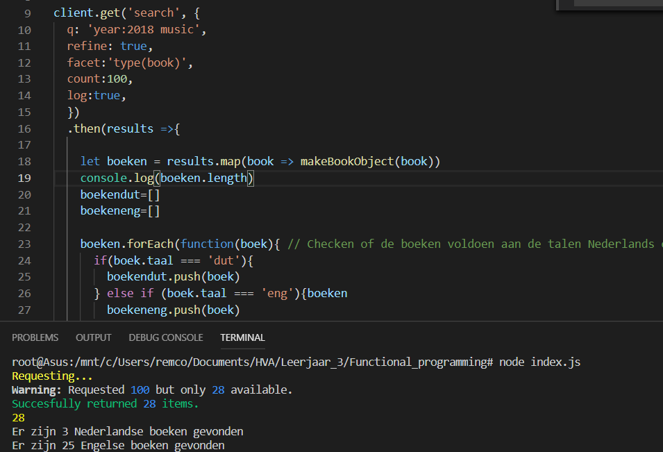
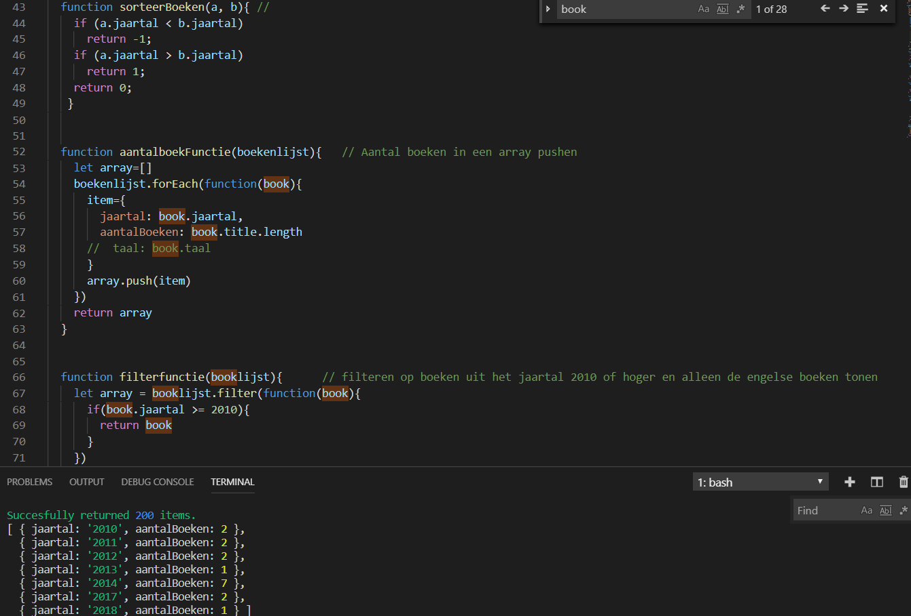
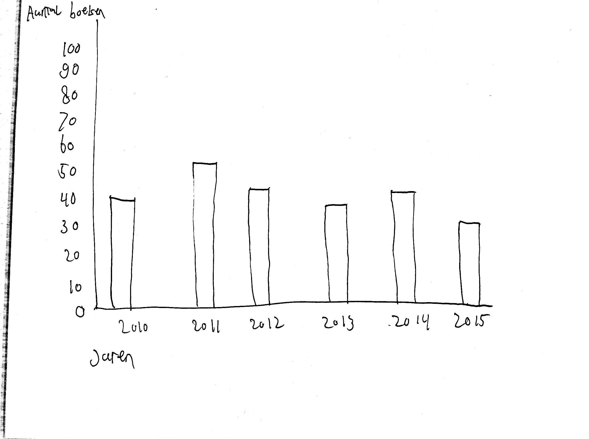
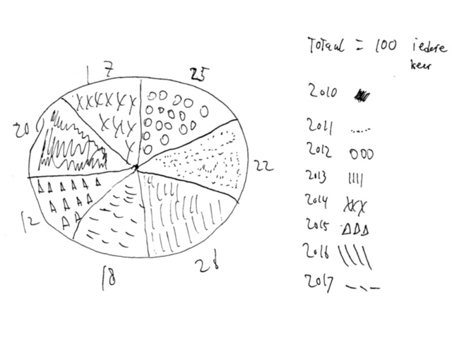

# Oba
* link naar observable
Ik ben tijd te kort gekomen om mijn visualisatie met d3 helemaal zelf te maken. Ik heb nu in een voorbeeld van **Ray Hong** mijn data van log.json bestand ingeladen zodat mijn data in ieder geval in een barchart staat.
https://beta.observablehq.com/@remcopasma/d3-barchart 
# Inhoud
* 1 | Search
* 2 | Onderzoek
* 3 | Bevindingen
* 4 | Schetsen
* 5 | Problemen
* 6 | Conclusie
* 7 | Waar ben ik trots op
* 8 | Credits
* 9 | Bronnen

# 1 | Search
Tijdens het kijken naar de OBA Api heb ik gekeken naar **Search**. Ik ben door de lijst gaan kijken waar ik allemaal op kon zoeken om de Api beter te begrijpen.


 
# 2 | Onderzoek
## Onderzoeksvragen
1. Is er in de afgelopen 8 jaar veel verschil gekomen in de hoeveelheid engelse boeken als je zoekt op het woord music?
2. Is er stijgende lijn tussen te zien in het aantal Engelse boeken ten opzichte van de Nederlandse boeken als je zoekt op het woord muziek?
3. Is er na de oorlog een stijging in het aantal duitse boeken te zien of juist helemaal niet?
4. Binnen de categorie romans zijn het aantal boeken de afgelopen 5 jaar gedaald?
5. Waar zijn de meeste boeken gepubliceerd in het afgelopen jaar.

## Uiteindelijk gekozen onderzoeksvraag
Is er in de afgelopen 8 jaar veel verschil gekomen in de hoeveelheid engelse boeken als je zoekt op het woord music?

## Hypothese
Er is de afgelopen jaar een daling in het aantal engelse boeken met het woord music erin.

## Bijbehorende Deelvragen 
1. Is het totale aantal 100 wat ik terugkrijg als ik count op 100 zet of zijn er boeken met een andere taal dan nederlands of engels?
2. Daalt het aantal nederlandse boeken als je steeds een jaar verder gaat?
3. Is het aantal engelse boeken steeds meer gaan stijgen als je een jaar verder gaat?
4. Wat zijn de verschillen per jaar vanaf 2010 tot nu?

## Welke variabele heb ik nodig om de juiste data uit de API te halen?
Ik ben in de search gaan kijken welke variabele ik in ieder geval moet gaan gebruiken om mijn onderzoeksvraag te kunnen beantwoorden.
* Ik wil de **Titel** van het boek hebben
* Ik wil de **Language** van een boek hebben
* Ik wil het **Jaar** van uitgave hebben. 


## Verwachtingen
Ik verwacht dat van de 100 boeken die ik ophaal er een daling zit in het aantal engelse boeken met het woord music. Dit omdat de mensen steeds meer online bekijken.

# 3 | Bevindingen 
Ik ben gaan kijken naar hoe de Api werkt en in elkaar zit en kwam tot het volgende:
* Met 20 resultaten krijgen kun je geen conclusies trekken
* Er is veel data die je niet nodig hebt, dit moet je dus omzetten naar data waar je wat aan hebt.

Nadat ik erachter was op welke data ik wilde filteren en ik bruikbare informatie terug kreeg ben ik tot de volgende bevindingen gekomen:

* Er zijn niet altijd 100 boeken die aan de query voldoen.
* Er is geen duidelijke lijn te vinden in het aantal boeken per jaar. Opvallend is dat in 2013 en 2014 het aantal 37 word behaald en daarna in 2015 en 2016 het aantal sterk is gedaald naar 10 en 9. In 2017 is dit sterk gestegen naar 78. Dit kon ik uitlezen toen ik mijn code nog **niet** had herschreven, en mijn data nog niet in een array met de waarden **jaartal** en **aantalBoeken** terug kreeg. De code waarmee ik dit ophaalde:
```
boekendut=[]
boekeneng=[]
   
     boeken.forEach(function(boek){ // Checken of de boeken voldoen aan de talen Nederlands of Engels.
       if(boek.taal === 'dut'){
         boekendut.push(boek)
       } else if (boek.taal === 'eng'){boeken
         boekeneng.push(boek)
       }
     })

   
    console.log('Er zijn',boekendut.length,'Nederlandse boeken gevonden') // Nederlandse boeken teruggeven 
    console.log('Er zijn',boekeneng.length,'Engelse boeken gevonden') // Engelse boeken terug geven
```
* Bij het ophalen van 100 boeken in het jaar 2018 krijg ik de volgende data terug:

* Dit kan ik dus per jaar doen en zo krijg ik een overzicht hoeveel engelse boeken met het woord music er per jaar zijn gevonden.

* Om mijn data uiteindelijk met d3 te visualiseren moest ik mijn data in een array stoppen. Ik console.log nu in de meest recente versie de jaartallen 2010-2018 met het aantal engelse boeken. De count heb ik op 200 staan zodat ik iets meer data terug krijg. 


# 4 | Schetsen


* Ik heb uiteindelijk gekozen voor de barchart omdat dit veel overzichtelijker is, en naar mijn mening een betere manier is om de data te visualiseren.
# 5 | Problemen
De problemen waar ik tegen aan ben gelopen de afgelopen 2 weken:
* Ik vond het lastig om een goede onderzoeksvraag te bedenken omdat ik in het begin nog niet de juiste data kon ophalen. Ik heb mijn onderzoeksvraag hierdoor aangepast. Mijn eerste onderzoeksvraag was: **Is het aantal Engelse boeken de afgelopen 8 jaar juist gestegen of gedaald.** Ik vond dat ik deze wat specifieker moest maken zodat ik wat betere data terug kon krijgen.
* Ik wilde weten hoeveel boeken engels waren in ieder jaar en had hiervoor een functie geschreven:
```
function calculate(book){
 let jaartal = (typeof book.publication === "undefined" || typeof book.publication.year === "undefined") ? 'Jaar onbekend' : book.publication.year.$t;
    if(jaartaal == 2016){
      return true;
    }
}
```
In de query had ik ```filter: calculate ``` en ```facet=language(eng)  ``` staan wat ervoor zorgt dat ik alle engelse boeken uit 2016 krijg. Ik kreeg hier ook resultaten uit maar kon hier geen conclusies uit trekken. Ik heb dus mijn onderzoeksvraag aangepast om betere data te krijgen. Ik heb dit uiteindelijk nog op twee andere manieren moeten schrijven. 1 manier staat onder het kopje **bevindingen**
* Ik kreeg in het begin het niet voor elkaar om meer dan 20 resultaten op te halen. Hierdoor kon ik geen conclusies trekken en kon ik mijn deelvragen moeilijk beantwoorden. Wouter heeft mij hier uiteindelijk bij geholpen.
* Nadat ik mijn data in een array terugrkeeg waar per jaar het aantal engelse boeken staat, Is het mij niet gelukt om de count ook daadwerkelijk over de jaren 2010-2018 te laten gaan, de count begint nu bij het jaar 1917. Hierdoor krijg ik kleine aantallen terug en kan ik hier geen conclusies uit trekken.

# 6 | Conclusie
Ik kan uiteindelijk niet zeggen of er een stijging of daling zit in het aantal engelse boeken. Dit omdat ik het niet voor elkaar heb gekregen om de count over de jaren 2010-2018 te laten gaan. Wel kan ik zeggen dat ik ontzettend veel geleerd heb over het werken met een Api en het schrijven van functionele code. Ik had nog nooit met een Api gewerkt, vond het ook echt lastig maar naar mate je steeds verder komt in het proces en je meer voor elkaar krijgt is het ook echt tof om te doen. 


# 7 | Stukje code waar ik trots op ben
* De functie sorteerBoeken heb ik samen met lock geschreven. Deze functie sorteert de jaren op volgorde. Hij vergelijkt steeds 2 jaartallen en op basis daarvan plaatst hij hem omhoog of omlaag. 
* De functie aantalboekFunctie maakt een object item aan met daarin de properties jaartal en aantalBoeken. In deze properties worden de jaartallen gestopt. En in aantalBoeken wordt de lengte van de array title meegegeven.
* De filterfunctie toont alleen de boeken die uitgegeven zijn in 2010 of hoger met de taal engels
```
function sorteerBoeken(a, b){ // 
    if (a.jaartal < b.jaartal)
      return -1;
    if (a.jaartal > b.jaartal)
      return 1;
    return 0;
   } 


  function aantalboekFunctie(boekenlijst){   // Aantal boeken in een array pushen
    let array=[]
    boekenlijst.forEach(function(book){
      item={
        jaartal: book.jaartal,
        aantalBoeken: book.title.length
      //  taal: book.taal
      }
      array.push(item)
    })
    return array
  }


  function filterfunctie(booklijst){      // filteren op boeken uit het jaartal 2010 of hoger en alleen de engelse boeken tonen
    let array = booklijst.filter(function(book){
      if(book.jaartal >= 2010 && book.taal =='eng'){
        return book
      }
    })
    return array
  }

```

# 8 | Credits 
* Wouter 
* Joost 
* Lock

# 9 | Bronnen
Oba Api

